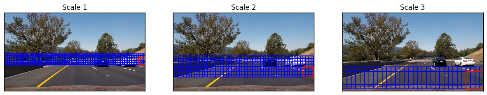
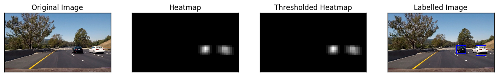

##Writeup Template
###You can use this file as a template for your writeup if you want to submit it as a markdown file, but feel free to use some other method and submit a pdf if you prefer.

---

**Vehicle Detection Project**

The goals / steps of this project are the following:

* Perform a Histogram of Oriented Gradients (HOG) feature extraction on a labeled training set of images and train a classifier Linear SVM classifier
* Optionally, you can also apply a color transform and append binned color features, as well as histograms of color, to your HOG feature vector. 
* Note: for those first two steps don't forget to normalize your features and randomize a selection for training and testing.
* Implement a sliding-window technique and use your trained classifier to search for vehicles in images.
* Run your pipeline on a video stream (start with the test_video.mp4 and later implement on full project_video.mp4) and create a heat map of recurring detections frame by frame to reject outliers and follow detected vehicles.
* Estimate a bounding box for vehicles detected.

[//]: # (Image References)
[image1]: ./examples/car_not_car.png 
[image2]: ./examples/HOG_example.jpg
[image3]: ./examples/sliding_windows.jpg
[image4]: ./examples/sliding_window.jpg
[image5]: ./examples/bboxes_and_heat.png
[image6]: ./examples/labels_map.png
[image7]: ./examples/output_bboxes.png
[video1]: ./project_video.mp4

## [Rubric](https://review.udacity.com/#!/rubrics/513/view) Points
###Here I will consider the rubric points individually and describe how I addressed each point in my implementation.  

---

###Histogram of Oriented Gradients (HOG)

The code for HOG feature extraction can be found on line 50 of `./utils/featureExtraction.py.`

I started by reading in all the `vehicle` and `non-vehicle` images.  Here is an example of one of each of the `vehicle` and `non-vehicle` classes:

![alt text][image1]

I then explored different color spaces and different `skimage.hog()` parameters (`orientations`, `pixels_per_cell`, and `cells_per_block`).  I grabbed random images from each of the two classes and displayed them to get a feel for what the `skimage.hog()` output looks like.

Here is an example using the `YCrCb` color space and HOG parameters of `orientations=8`, `pixels_per_cell=(8, 8)` and `cells_per_block=(2, 2)`:


![alt text][image2]

####2. Feature Extraction for Model

I tried various combinations of parameters and color spaces before finding the right mix to go with:
```
color_space = 'YCrCb'
spatial_size = (32, 32)
hist_bins = 32
orient = 9
pix_per_cell = 8
cell_per_block = 2
hog_channel = 'ALL'
spatial_feat = True
hist_feat = True
hog_feat = True
```
Increasing the orientation enhanced the accuarcy of the finally trained classifier, but increased the time required for computation.

####3. Model Training
The extracted features where fed to LinearSVC model of sklearn with default setting of square-hinged loss function and l2 normalization. The trained model had accuracy of 99.36% on test dataset. The SVC with rbf kernel performed better with accuracy of 99.79% as compared to the LinearSVC but was very slow in predicting labels and hence was discarded.

The trained model along with the parameters used for training were written to a pickle file to be further used by vehicle detection pipeline.

###Sliding Window Search

####1. Sliding Window Search

I used the function `find_cars` in line 103 in `./utils/featureExtraction.py` to extract features using hog sub-sampling and make predictions.  A sample output from the same is shown below.

![alt text][image3]

####2. Multi-Scale Search

The multi-scale window approach prevents calculation of feature vectors for the complete image and thus helps in speeding up the process. 

Ultimately I searched on two scales using YCrCb 3-channel HOG features plus spatially binned color and histograms of color in the feature vector, which provided a nice result.  The figure below shows the multiple scales under consideration overlapped on image.


---

### Video Implementation

### 1. Vehicle Detection
Here's a [link to my video result](./project_video_output_without_lanes.mp4)
<video width="960" height="540" controls>
  <source src="project_video_output_without_lanes.mp4">
</video>

### 2. Avoiding False Positives and Label Detection

#### A. Hard Data Mining
Falsely detected patch were explicitly used to create a negative example added to training set. The false positives were avoided by using wrongly classified examples and adding it to the training dataset.

#### B. Feature Selection
Using `YCrCb` color space, the number of false positives were stemmed.

#### C. Heatmaps and Label Detection
I recorded the positions of positive detections in each frame of the video.  From the positive detections I created a heatmap and then thresholded that map to identify vehicle positions.  I then used `scipy.ndimage.measurements.label()` to identify individual blobs in the heatmap.  I then assumed each blob corresponded to a vehicle.  I constructed bounding boxes to cover the area of each blob detected.  

 

---

###Discussion

Here I'll talk about the approach I took, what techniques I used, what worked and why, where the pipeline might fail and how I might improve it if I were going to pursue this project further.  

